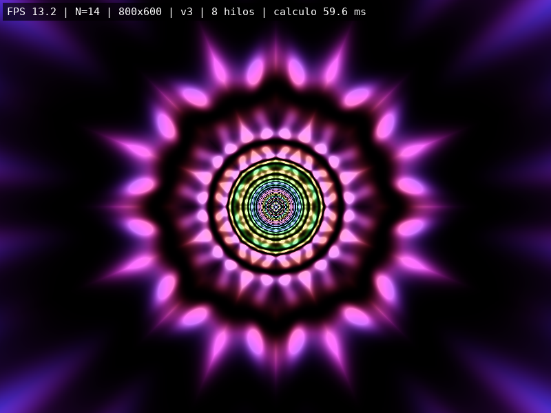
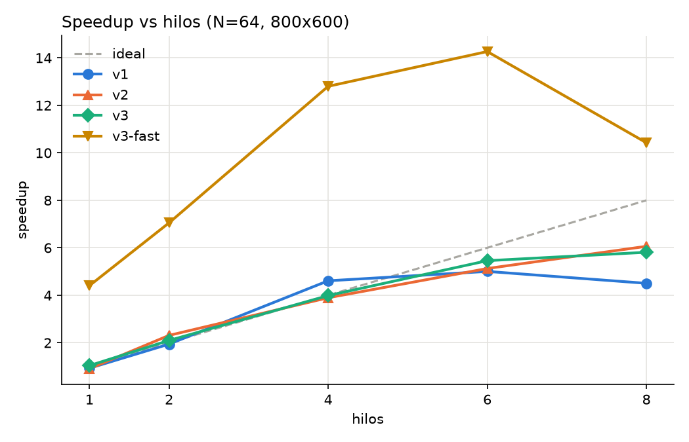
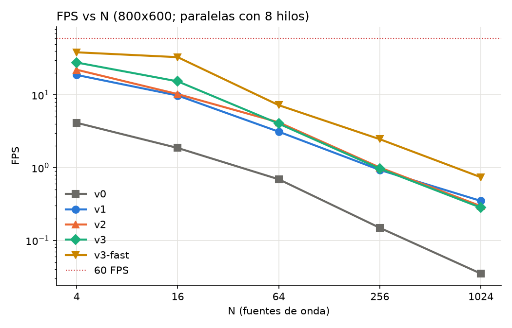

# Screensaver "Túnel Caleidoscópico de Interferencia" — OpenMP

Proyecto 1 · Computación Paralela y Distribuida · Universidad del Valle de Guatemala, 2026

| Integrante | Carné |
|---|---|
| Carlos Daniel Estrada Vega | 20853 |
| André Emilio Pivaral López | 23574 |
| Daniela Ramírez de León | 23053 |



## Descripción

N **fuentes de onda** orbitan en un plano; el color de cada píxel se obtiene de la **superposición (interferencia)** de las N ondas, evaluada píxel por píxel en el CPU. Antes de sumar las ondas, cada píxel se pasa a coordenadas polares, su ángulo se "dobla" en sectores para lograr la simetría de caleidoscopio y el radio se transforma con `1/r` para dar la profundidad de un túnel. El resultado es un túnel poligonal con anillos que avanzan hacia un centro brillante, en bandas de color que cambian con las ondas.

- **Física y trigonometría:** órbitas con `sin`/`cos`, conversión cartesiana → polar (`sqrt`, `atan2`), proyección `1/r` y superposición de ondas (se refuerzan en fase y se cancelan en oposición).
- **Colores pseudoaleatorios:** tono, frecuencia, amplitud, fase y órbita de cada fuente salen de `std::mt19937` con semilla configurable.
- **SDL 2** solo abre la ventana y sube el búfer ya calculado (una `SDL_UpdateTexture` por frame); los FPS se dibujan con **SDL_ttf**. Todo el cálculo es CPU + **OpenMP**.

## Estructura

```
├── Makefile
├── src/
│   ├── kaleidoscope.hpp/.cpp   núcleo matemático compartido, validación de argumentos
│   ├── motor.hpp/.cpp          ventana SDL (RAII), FPS en pantalla, modo benchmark
│   ├── screensaver_seq.cpp     versión secuencial (v0)
│   └── screensaver_par.cpp     versiones paralelas v1, v2, v3 y --verify
├── bench/
│   ├── run_bench.sh            batería completa de pruebas
│   ├── plot_results.py         speedup, eficiencia, tablas y gráficas
│   └── results/                CSV, bitácora y PNG generados
├── docs/                       informe (md + pdf) y anexos 1–3
└── capturas/                   evidencia de ejecución
```

## Dependencias

| Sistema | Instalación |
|---|---|
| Debian / Ubuntu / WSL | `sudo apt install build-essential pkg-config libsdl2-dev libsdl2-ttf-dev fonts-dejavu-core` |
| Fedora | `sudo dnf install gcc-c++ make pkgconf SDL2-devel SDL2_ttf-devel dejavu-sans-mono-fonts` |
| macOS (Homebrew) | `brew install sdl2 sdl2_ttf pkg-config libomp` (usar `g++` de Homebrew o `clang++ -Xpreprocessor -fopenmp -lomp`) |
| Windows (MSYS2 UCRT64) | `pacman -S mingw-w64-ucrt-x86_64-{gcc,make,pkgconf,SDL2,SDL2_ttf}` |

Para las gráficas: Python 3 con `matplotlib` (`sudo apt install python3-matplotlib` o `pip install matplotlib`).

## Compilación

```bash
make            # screensaver_seq y screensaver_par (-O2 -Wall -Wextra, sin advertencias)
make par_fast   # variante experimental -O3 -march=native -ffast-math
make clean
```

Equivalente manual:

```bash
g++ -O2 -std=c++17 -Wall -Wextra src/screensaver_seq.cpp src/kaleidoscope.cpp src/motor.cpp -o screensaver_seq $(pkg-config --cflags --libs sdl2 SDL2_ttf)
g++ -O2 -std=c++17 -Wall -Wextra -fopenmp src/screensaver_par.cpp src/kaleidoscope.cpp src/motor.cpp -o screensaver_par $(pkg-config --cflags --libs sdl2 SDL2_ttf)
```

## Parámetros

| Parámetro | Rango | Default | Descripción |
|---|---|---|---|
| `--n` | 1 – 4096 | **obligatorio** | Cantidad de fuentes de onda |
| `--ancho` | 640 – 3840 | 800 | Ancho del canvas |
| `--alto` | 480 – 2160 | 600 | Alto del canvas |
| `--simetria` | 3 – 24 | 8 | Orden de simetría del caleidoscopio |
| `--semilla` | 0 – 1 000 000 | 2026 | Semilla pseudoaleatoria |
| `--frames` | ≥ 0 | 0 (infinito) | Frames a ejecutar; con `--bench`, frames medidos (≥ 10, default 20) |
| `--fullscreen` | — | no | Pantalla completa |
| `--captura` | archivo `.bmp` | — | Guarda el último frame (requiere `--frames`) |
| `--bench` | — | no | Mide el tiempo de cálculo sin abrir ventana |
| `--csv` | archivo | — | Con `--bench`, agrega una fila de resultados |
| `--version` | 1 – 3 | 3 | *(solo paralela)* Variante paralela |
| `--hilos` | 1 – 256 | todos | *(solo paralela)* Hilos OpenMP |
| `--schedule` | static, dynamic, guided | guided | *(solo paralela)* Reparto de filas en v2/v3 |
| `--chunk` | 0 – 4096 | 0 (default) | *(solo paralela)* Filas por bloque |
| `--verify` | — | no | *(solo paralela)* Compara v1–v3 contra la secuencial |

Los valores se validan con `strtol` + comprobación del puntero final + rango. Ejemplos de rechazo:

```
$ ./screensaver_seq --n 0
Error: --n = 0 fuera de rango [1, 4096].
$ ./screensaver_par --n 10 --ancho 12abc
Error: --ancho debe ser un entero, se recibió "12abc".
$ ./screensaver_par --n 10 --colores 5
Error: argumento desconocido "--colores".
```

## Ejecución

```bash
./screensaver_seq --n 14                                  # secuencial, 800x600
./screensaver_par --n 14                                  # paralela v3 con todos los hilos
./screensaver_par --n 64 --version 2 --hilos 4 --schedule dynamic --chunk 4
./screensaver_par --n 40 --ancho 1280 --alto 720 --simetria 12 --fullscreen
./screensaver_par --n 64 --verify                         # correctitud bit a bit
```

**Controles:** `ESC` o `Q` para salir (también cerrando la ventana). En pantalla se muestran FPS, N, resolución, versión, hilos y tiempo de cálculo del frame; si SDL_ttf o la fuente no cargan, esa línea aparece en el título de la ventana.

Sin pantalla (servidor/CI): `xvfb-run -a ./screensaver_par --n 14 --frames 90`.

## Versiones

| Versión | Cambio | Por qué debería ser más rápida |
|---|---|---|
| v0 | Secuencial | Referencia |
| v1 | `parallel for collapse(2) schedule(static)` sobre los píxeles | Los píxeles son independientes: cada hilo escribe índices distintos, sin `critical` ni `atomic` |
| v2 | Filas completas con `schedule(runtime)`, fuentes en paralelo si N ≥ 256, `reduction(+:suma RGB)` | Menos overhead de reparto que `collapse`, bloques contiguos (sin falso compartimiento) y schedule configurable |
| v3 | Tabla polar precalculada en paralelo + una sola región `parallel` por frame | Quita `sqrt`, `atan2` y `fmod` del bucle caliente y crea el equipo de hilos una vez por frame |
| v3-fast | v3 compilada con `-O3 -march=native -ffast-math` | Vectoriza el bucle sobre N (`omp simd`, AVX2); cambia el orden de las operaciones de punto flotante |

`--verify` calcula un frame en t = 3.7 con la secuencial y con v1–v3 y compara búferes (píxeles distintos, diferencia máxima por canal, hash FNV-1a). En todas las pruebas las tres versiones fueron **idénticas bit a bit** a la secuencial.

## Benchmark

```bash
make seq par par_fast
bash bench/run_bench.sh           # ~50 min; MEDICIONES=10 por defecto
python3 bench/plot_results.py     # resultados.csv, tablas.md y gráficas
```

Cada configuración descarta 5 frames de calentamiento y mide al menos 10 frames, cronometrando **solo el cálculo** (`std::chrono::steady_clock`). Speedup = T<sub>secuencial</sub> / T<sub>paralelo</sub> con el **promedio** de los tiempos; eficiencia = speedup / hilos.

## Resultados

Medido en un AMD Ryzen 5 7520U (4 núcleos / 8 hilos lógicos), WSL 2 Ubuntu, g++ 15.2 `-O2`. Detalle completo en [docs/anexo3_bitacora.md](docs/anexo3_bitacora.md) y [bench/results/](bench/results/).

**Speedup con 8 hilos** (N = 64, 800×600, repetición intercalada de 3 × 10 mediciones; T<sub>v0</sub> = 1556 ms):

| Versión | Tiempo por frame | Speedup | Eficiencia |
|---|---|---|---|
| v1 (collapse, static) | 219 ms | 7.10 | 0.89 |
| v3 static | 199 ms | 7.81 | 0.98 |
| v3 guided | 188 ms | 8.30 | 1.04 |

**Speedup contra N** (800×600, 8 hilos, barrido B):

| N | v1 | v2 | v3 | v3-fast |
|---|---|---|---|---|
| 4 | 4.55 | 5.36 | 6.74 | 9.31 |
| 16 | 5.26 | 5.50 | 8.23 | 17.69 |
| 64 | 4.50 | 6.06 | 5.81 | 10.42 |
| 256 | 6.23 | 6.73 | 6.50 | 16.48 |
| 1024 | 10.13 | 8.59 | 8.18 | 21.41 |

**N máximo a 60 FPS (640×480):** v0, v1 y v2 no llegan (7.9, 58.7 y 56.7 FPS con N = 1); **v3: N = 3** (69 FPS); **v3-fast: N = 16** (61 FPS).

- Escalamiento casi lineal hasta 4 hilos (núcleos físicos); de 4 a 8 hilos SMT sigue sumando porque el ciclo de ondas está limitado por latencia.
- El speedup crece con N (más cómputo por la misma sobrecarga fija por frame).
- v3 es 20–33 % más rápida que v2 con N pequeño (tabla polar); con N grande domina el ciclo de ondas.
- `guided` fue el mejor schedule y quedó como default.
- La máquina es una laptop: la línea base secuencial varió hasta ±21 %, lo que explica algunos speedups aparentes mayores que 8 (ver análisis en el informe).




## Documentación

- [Informe (PDF)](docs/informe.pdf) · [fuente Markdown](docs/informe.md)
- [Anexo 1 — Diagrama de flujo](docs/anexo1_diagrama_flujo.md)
- [Anexo 2 — Catálogo de funciones](docs/anexo2_catalogo.md)
- [Anexo 3 — Bitácora de pruebas](docs/anexo3_bitacora.md)

