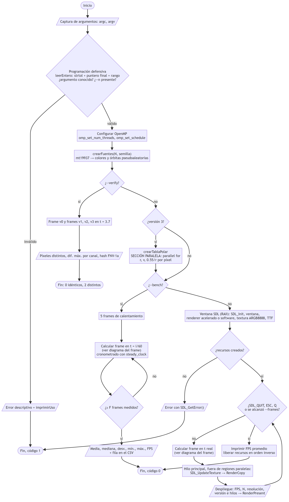
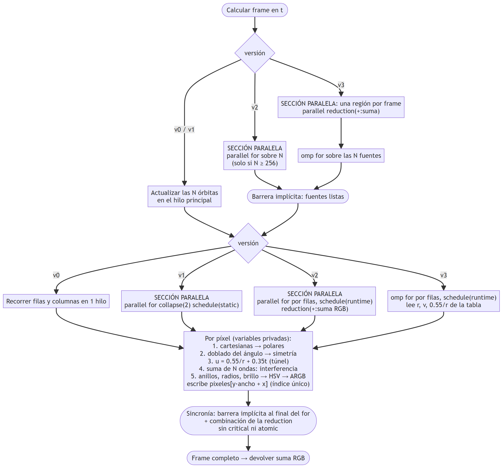

# Anexo 1 — Diagrama de flujo

El diagrama se divide en dos partes para que sea legible. La figura A1 muestra el programa completo: captura de argumentos, validación (programación defensiva), configuración de OpenMP, los tres modos de ejecución (verificación, benchmark e interactivo) y el despliegue de resultados. La figura A2 detalla el cálculo de un frame en cada versión, con las secciones paralelas y los mecanismos de sincronía (barreras implícitas y reducción).

Fuentes en Mermaid: `anexo1_diagrama_flujo.mmd` y `anexo1_diagrama_frame.mmd` (también exportadas a SVG).

**Figura A1.** Flujo general del programa (secuencial y paralelo).

**Figura A2.** Cálculo de un frame: secciones paralelas y sincronía por versión.

**Leyenda:** los rectángulos son procesos, los rombos son decisiones, los paralelogramos son entradas y salidas, y los óvalos de la figura A2 son puntos de sincronización. "Sección paralela" marca las regiones donde trabaja el equipo de hilos de OpenMP; todas las llamadas a SDL ocurren fuera de ellas, en el hilo principal.
