# Anexo 3 — Bitácora de pruebas

## Entorno y protocolo

| | |
|---|---|
| Procesador | AMD Ryzen 5 7520U (4 núcleos físicos, 8 hilos lógicos con SMT; 2.8 GHz base, hasta 4.3 GHz) |
| Sistema | Windows 11 Pro + WSL 2 (Ubuntu), laptop conectada a la corriente, plan de energía "Equilibrado" |
| Compilador | g++ 15.2.0; `-O2 -std=c++17 -Wall -Wextra` (+ `-fopenmp` en la paralela); v3-fast: `-O3 -march=native -ffast-math` |
| Bibliotecas | SDL 2.32.10, SDL_ttf 2.24.0 |
| Fecha | 23 de septiembre de 2026 |

- Comando: `bash bench/run_bench.sh` y luego `python3 bench/plot_results.py`. La salida completa de la consola está en `bench/results/bitacora.log` y los datos en `bench/results/crudo.csv` y `resultados.csv`.
- Cada prueba (configuración) descarta **5 frames de calentamiento** y mide **10 frames**. Se cronometra solo el cálculo del frame (`std::chrono::steady_clock`), sin ventana (`--bench`).
- **Speedup** = Tv0 / Tversión usando el **promedio** de los 10 tiempos, contra la secuencial v0 con el mismo N y la misma resolución. **Eficiencia** = speedup / hilos.
- **Fracción serial de Karp-Flatt:** e = (1/S − 1/p) / (1 − 1/p).
- Los barridos A, B, C y la búsqueda de 60 FPS usan `schedule(static)` en v2 y v3; el barrido D y la repetición comparan schedules.
- En v3-fast el speedup mezcla dos efectos: la paralelización y la vectorización de `-ffast-math`, por eso su eficiencia supera 1.

## Verificación de correctitud (`--verify`)

| Configuración | Schedule | Hash v0 | v1 | v2 | v3 | Suma RGB v0 = v2 = v3 |
|---|---|---|---|---|---|---|
| N=64, 800x600, simetría 8, semilla 2026 | static | e811ea536f4172b1 | idéntica | idéntica | idéntica | 93 422 142 |
| N=64, 800x600 | dynamic,4 | e811ea536f4172b1 | idéntica | idéntica | idéntica | 93 422 142 |
| N=64, 800x600 | guided | e811ea536f4172b1 | idéntica | idéntica | idéntica | 93 422 142 |
| N=16, 1280x720, simetría 12, semilla 7 | static | aba0778f851b1612 | idéntica | idéntica | idéntica | 164 069 643 |
| N=32, 800x600 | guided | eae9492a6c34c7ae | idéntica | idéntica | idéntica | 89 389 627 |
| build `-ffast-math`, N=64 y N=16 | static | mismos hashes que el build normal | idéntica | idéntica | idéntica | igual |

En todos los casos: **0 píxeles distintos y diferencia máxima por canal 0**. Con `-ffast-math` los cálculos intermedios sí cambian en los últimos bits, pero en estas pruebas ninguna diferencia alcanzó a cambiar un canal de 8 bits, por lo que el hash coincidió con el del build normal.

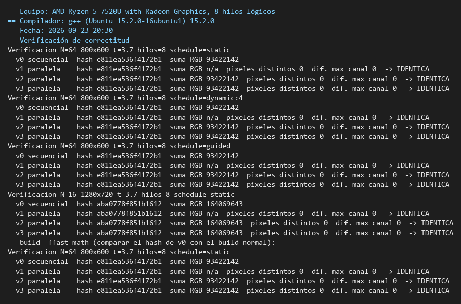

## Resultados por barrido

### Barrido A — hilos (N=64, 800x600)

| versión | hilos | N | resolución | schedule | media (ms) | mediana | desv | mín | máx | FPS | speedup | eficiencia | fracción serial (Karp-Flatt) |
|---|---|---|---|---|---|---|---|---|---|---|---|---|---|
| v0 | 1 | 64 | 800x600 | - | 1444.29 | 1372.51 | 306.21 | 1045.25 | 1866.35 | 0.69 | 1.00 | 1.00 | — |
| v1 | 1 | 64 | 800x600 | static-collapse2 | 1556.40 | 1581.60 | 148.94 | 1293.20 | 1712.70 | 0.64 | 0.93 | 0.93 | — |
| v1 | 2 | 64 | 800x600 | static-collapse2 | 743.92 | 753.55 | 120.19 | 592.65 | 914.32 | 1.34 | 1.94 | 0.97 | 0.030 |
| v1 | 4 | 64 | 800x600 | static-collapse2 | 313.34 | 310.19 | 13.75 | 297.90 | 336.53 | 3.19 | 4.61 | 1.15 | -0.044 |
| v1 | 6 | 64 | 800x600 | static-collapse2 | 288.59 | 283.69 | 31.37 | 248.46 | 330.99 | 3.46 | 5.00 | 0.83 | 0.040 |
| v1 | 8 | 64 | 800x600 | static-collapse2 | 320.71 | 287.74 | 75.96 | 235.84 | 459.10 | 3.12 | 4.50 | 0.56 | 0.111 |
| v2 | 1 | 64 | 800x600 | static | 1591.26 | 1632.24 | 197.56 | 1240.50 | 1851.64 | 0.63 | 0.91 | 0.91 | — |
| v2 | 2 | 64 | 800x600 | static | 625.27 | 622.60 | 60.65 | 554.07 | 735.96 | 1.60 | 2.31 | 1.15 | -0.134 |
| v2 | 4 | 64 | 800x600 | static | 370.75 | 367.06 | 33.64 | 319.73 | 434.34 | 2.70 | 3.90 | 0.97 | 0.009 |
| v2 | 6 | 64 | 800x600 | static | 281.72 | 269.70 | 34.21 | 259.39 | 374.98 | 3.55 | 5.13 | 0.85 | 0.034 |
| v2 | 8 | 64 | 800x600 | static | 238.26 | 236.70 | 7.88 | 228.16 | 255.67 | 4.20 | 6.06 | 0.76 | 0.046 |
| v3 | 1 | 64 | 800x600 | static | 1390.52 | 1376.53 | 192.28 | 1134.84 | 1708.54 | 0.72 | 1.04 | 1.04 | — |
| v3 | 2 | 64 | 800x600 | static | 688.94 | 657.77 | 163.05 | 538.63 | 1090.96 | 1.45 | 2.10 | 1.05 | -0.046 |
| v3 | 4 | 64 | 800x600 | static | 362.25 | 367.11 | 11.41 | 337.35 | 373.34 | 2.76 | 3.99 | 1.00 | 0.001 |
| v3 | 6 | 64 | 800x600 | static | 264.70 | 257.86 | 22.27 | 236.32 | 309.75 | 3.78 | 5.46 | 0.91 | 0.020 |
| v3 | 8 | 64 | 800x600 | static | 248.55 | 248.20 | 39.80 | 201.95 | 314.02 | 4.02 | 5.81 | 0.73 | 0.054 |
| v3-fast | 1 | 64 | 800x600 | static | 327.80 | 322.77 | 26.66 | 299.62 | 373.52 | 3.05 | 4.41 | 4.41 | — |
| v3-fast | 2 | 64 | 800x600 | static | 204.87 | 206.40 | 15.91 | 180.87 | 225.94 | 4.88 | 7.05 | 3.52 | -0.716 |
| v3-fast | 4 | 64 | 800x600 | static | 112.84 | 113.07 | 3.67 | 106.74 | 118.05 | 8.86 | 12.80 | 3.20 | -0.229 |
| v3-fast | 6 | 64 | 800x600 | static | 101.25 | 95.54 | 18.02 | 91.53 | 151.90 | 9.88 | 14.26 | 2.38 | -0.116 |
| v3-fast | 8 | 64 | 800x600 | static | 138.56 | 116.00 | 48.64 | 98.13 | 223.57 | 7.22 | 10.42 | 1.30 | -0.033 |

### Barrido B — N (800x600, 8 hilos)

| versión | hilos | N | resolución | schedule | media (ms) | mediana | desv | mín | máx | FPS | speedup | eficiencia |
|---|---|---|---|---|---|---|---|---|---|---|---|---|
| v0 | 1 | 4 | 800x600 | - | 241.96 | 251.70 | 21.89 | 206.21 | 267.91 | 4.13 | 1.00 | 1.00 |
| v1 | 8 | 4 | 800x600 | static-collapse2 | 53.23 | 51.77 | 6.38 | 46.39 | 70.22 | 18.79 | 4.55 | 0.57 |
| v2 | 8 | 4 | 800x600 | static | 45.14 | 45.77 | 2.14 | 42.46 | 48.73 | 22.16 | 5.36 | 0.67 |
| v3 | 8 | 4 | 800x600 | static | 35.92 | 35.93 | 3.71 | 31.19 | 41.53 | 27.84 | 6.74 | 0.84 |
| v3-fast | 8 | 4 | 800x600 | static | 26.00 | 24.45 | 4.42 | 21.41 | 35.69 | 38.47 | 9.31 | 1.16 |
| v0 | 1 | 16 | 800x600 | - | 536.37 | 538.26 | 118.97 | 372.46 | 752.40 | 1.86 | 1.00 | 1.00 |
| v1 | 8 | 16 | 800x600 | static-collapse2 | 102.06 | 102.53 | 7.82 | 90.19 | 114.39 | 9.80 | 5.26 | 0.66 |
| v2 | 8 | 16 | 800x600 | static | 97.57 | 100.93 | 17.94 | 73.51 | 121.89 | 10.25 | 5.50 | 0.69 |
| v3 | 8 | 16 | 800x600 | static | 65.20 | 62.48 | 7.16 | 59.15 | 84.28 | 15.34 | 8.23 | 1.03 |
| v3-fast | 8 | 16 | 800x600 | static | 30.32 | 29.47 | 2.98 | 26.67 | 36.29 | 32.98 | 17.69 | 2.21 |
| v0 | 1 | 64 | 800x600 | - | 1444.29 | 1372.51 | 306.21 | 1045.25 | 1866.35 | 0.69 | 1.00 | 1.00 |
| v1 | 8 | 64 | 800x600 | static-collapse2 | 320.71 | 287.74 | 75.96 | 235.84 | 459.10 | 3.12 | 4.50 | 0.56 |
| v2 | 8 | 64 | 800x600 | static | 238.26 | 236.70 | 7.88 | 228.16 | 255.67 | 4.20 | 6.06 | 0.76 |
| v3 | 8 | 64 | 800x600 | static | 248.55 | 248.20 | 39.80 | 201.95 | 314.02 | 4.02 | 5.81 | 0.73 |
| v3-fast | 8 | 64 | 800x600 | static | 138.56 | 116.00 | 48.64 | 98.13 | 223.57 | 7.22 | 10.42 | 1.30 |
| v0 | 1 | 256 | 800x600 | - | 6697.97 | 7000.03 | 702.55 | 5484.54 | 7346.11 | 0.15 | 1.00 | 1.00 |
| v1 | 8 | 256 | 800x600 | static-collapse2 | 1074.69 | 977.22 | 214.66 | 857.17 | 1541.38 | 0.93 | 6.23 | 0.78 |
| v2 | 8 | 256 | 800x600 | static | 994.86 | 985.81 | 42.82 | 935.65 | 1063.98 | 1.00 | 6.73 | 0.84 |
| v3 | 8 | 256 | 800x600 | static | 1030.71 | 1031.44 | 85.04 | 896.84 | 1167.18 | 0.97 | 6.50 | 0.81 |
| v3-fast | 8 | 256 | 800x600 | static | 406.42 | 368.58 | 111.06 | 322.03 | 691.41 | 2.46 | 16.48 | 2.06 |
| v0 | 1 | 1024 | 800x600 | - | 28979.38 | 28857.30 | 926.11 | 27406.52 | 30533.77 | 0.04 | 1.00 | 1.00 |
| v1 | 8 | 1024 | 800x600 | static-collapse2 | 2861.89 | 2835.49 | 214.67 | 2601.51 | 3387.91 | 0.35 | 10.13 | 1.27 |
| v2 | 8 | 1024 | 800x600 | static | 3374.97 | 3302.08 | 347.81 | 2929.77 | 3986.31 | 0.30 | 8.59 | 1.07 |
| v3 | 8 | 1024 | 800x600 | static | 3541.42 | 3447.33 | 551.70 | 2918.14 | 4478.24 | 0.28 | 8.18 | 1.02 |
| v3-fast | 8 | 1024 | 800x600 | static | 1353.80 | 1338.66 | 219.46 | 1018.93 | 1678.92 | 0.74 | 21.41 | 2.68 |

### Barrido C — resolución (N=64, 8 hilos)

| versión | hilos | N | resolución | schedule | media (ms) | mediana | desv | mín | máx | FPS | speedup | eficiencia |
|---|---|---|---|---|---|---|---|---|---|---|---|---|
| v0 | 1 | 64 | 640x480 | - | 1057.21 | 1066.02 | 165.14 | 781.10 | 1290.16 | 0.95 | 1.00 | 1.00 |
| v1 | 8 | 64 | 640x480 | static-collapse2 | 134.48 | 131.81 | 11.94 | 119.21 | 155.64 | 7.44 | 7.86 | 0.98 |
| v2 | 8 | 64 | 640x480 | static | 144.27 | 138.82 | 12.75 | 132.65 | 173.12 | 6.93 | 7.33 | 0.92 |
| v3 | 8 | 64 | 640x480 | static | 126.18 | 123.54 | 7.46 | 114.89 | 141.53 | 7.92 | 8.38 | 1.05 |
| v3-fast | 8 | 64 | 640x480 | static | 60.73 | 55.06 | 14.84 | 46.29 | 87.04 | 16.46 | 17.41 | 2.18 |
| v0 | 1 | 64 | 800x600 | - | 1444.29 | 1372.51 | 306.21 | 1045.25 | 1866.35 | 0.69 | 1.00 | 1.00 |
| v1 | 8 | 64 | 800x600 | static-collapse2 | 320.71 | 287.74 | 75.96 | 235.84 | 459.10 | 3.12 | 4.50 | 0.56 |
| v2 | 8 | 64 | 800x600 | static | 238.26 | 236.70 | 7.88 | 228.16 | 255.67 | 4.20 | 6.06 | 0.76 |
| v3 | 8 | 64 | 800x600 | static | 248.55 | 248.20 | 39.80 | 201.95 | 314.02 | 4.02 | 5.81 | 0.73 |
| v3-fast | 8 | 64 | 800x600 | static | 138.56 | 116.00 | 48.64 | 98.13 | 223.57 | 7.22 | 10.42 | 1.30 |
| v0 | 1 | 64 | 1280x720 | - | 2815.35 | 2716.38 | 290.79 | 2513.90 | 3313.79 | 0.35 | 1.00 | 1.00 |
| v1 | 8 | 64 | 1280x720 | static-collapse2 | 614.53 | 599.61 | 75.20 | 515.71 | 747.20 | 1.63 | 4.58 | 0.57 |
| v2 | 8 | 64 | 1280x720 | static | 502.85 | 505.27 | 62.43 | 412.42 | 610.89 | 1.99 | 5.60 | 0.70 |
| v3 | 8 | 64 | 1280x720 | static | 401.16 | 395.15 | 33.49 | 360.54 | 463.61 | 2.49 | 7.02 | 0.88 |
| v3-fast | 8 | 64 | 1280x720 | static | 164.83 | 165.76 | 7.95 | 151.61 | 173.91 | 6.07 | 17.08 | 2.14 |
| v0 | 1 | 64 | 1920x1080 | - | 6841.70 | 6906.00 | 620.27 | 5474.40 | 7615.34 | 0.15 | 1.00 | 1.00 |
| v1 | 8 | 64 | 1920x1080 | static-collapse2 | 939.65 | 928.42 | 105.02 | 824.46 | 1196.73 | 1.06 | 7.28 | 0.91 |
| v2 | 8 | 64 | 1920x1080 | static | 884.24 | 869.78 | 92.48 | 798.12 | 1123.00 | 1.13 | 7.74 | 0.97 |
| v3 | 8 | 64 | 1920x1080 | static | 865.19 | 850.83 | 55.17 | 791.26 | 959.89 | 1.16 | 7.91 | 0.99 |
| v3-fast | 8 | 64 | 1920x1080 | static | 344.33 | 340.16 | 35.75 | 308.20 | 415.27 | 2.90 | 19.87 | 2.48 |

### Barrido D — schedules (N=64, 800x600, 8 hilos)

| versión | hilos | N | resolución | schedule | media (ms) | mediana | desv | mín | máx | FPS | speedup | eficiencia |
|---|---|---|---|---|---|---|---|---|---|---|---|---|
| v1 | 8 | 64 | 800x600 | static-collapse2 | 320.71 | 287.74 | 75.96 | 235.84 | 459.10 | 3.12 | 4.50 | 0.56 |
| v2 | 8 | 64 | 800x600 | static | 238.26 | 236.70 | 7.88 | 228.16 | 255.67 | 4.20 | 6.06 | 0.76 |
| v3 | 8 | 64 | 800x600 | static | 248.55 | 248.20 | 39.80 | 201.95 | 314.02 | 4.02 | 5.81 | 0.73 |
| v2 | 8 | 64 | 800x600 | static:8 | 231.37 | 223.51 | 22.11 | 202.33 | 264.58 | 4.32 | 6.24 | 0.78 |
| v2 | 8 | 64 | 800x600 | dynamic:1 | 199.36 | 193.38 | 18.07 | 181.81 | 234.51 | 5.02 | 7.24 | 0.91 |
| v2 | 8 | 64 | 800x600 | dynamic:4 | 232.59 | 230.86 | 33.95 | 189.18 | 307.43 | 4.30 | 6.21 | 0.78 |
| v2 | 8 | 64 | 800x600 | dynamic:16 | 213.18 | 214.24 | 20.33 | 186.85 | 245.92 | 4.69 | 6.77 | 0.85 |
| v2 | 8 | 64 | 800x600 | guided | 198.15 | 190.33 | 21.54 | 177.83 | 240.01 | 5.05 | 7.29 | 0.91 |
| v3 | 8 | 64 | 800x600 | static:8 | 223.92 | 226.92 | 17.11 | 198.34 | 249.04 | 4.47 | 6.45 | 0.81 |
| v3 | 8 | 64 | 800x600 | dynamic:1 | 214.43 | 213.25 | 28.73 | 172.13 | 260.88 | 4.66 | 6.74 | 0.84 |
| v3 | 8 | 64 | 800x600 | dynamic:4 | 210.27 | 210.09 | 20.38 | 183.84 | 242.18 | 4.76 | 6.87 | 0.86 |
| v3 | 8 | 64 | 800x600 | dynamic:16 | 190.57 | 191.65 | 7.31 | 177.19 | 201.12 | 5.25 | 7.58 | 0.95 |
| v3 | 8 | 64 | 800x600 | guided | 177.51 | 173.45 | 10.06 | 170.07 | 196.78 | 5.63 | 8.14 | 1.02 |

### N máximo que sostiene 60 FPS (640x480)

| versión | N máximo | FPS con ese N | FPS con N=1 |
|---|---|---|---|
| v0 | no alcanza | 0 | 7.87 |
| v1 | no alcanza | 0 | 58.74 |
| v2 | no alcanza | 0 | 56.73 |
| v3 | 3 | 69.45 | 91.26 |
| v3-fast | 16 | 60.69 | 117.26 |

### Repetición intercalada (N=64, 800x600, 8 hilos, 3 rondas de 10 mediciones)

| versión | schedule | media ronda 1 (ms) | ronda 2 | ronda 3 | promedio | speedup |
|---|---|---|---|---|---|---|
| v3 | static | 198.7 | 207.7 | 191.5 | **199.3** | 7.81 |
| v3 | static:8 | 207.4 | 207.3 | 197.3 | **204.0** | 7.63 |
| v3 | dynamic:4 | 189.9 | 171.7 | 193.2 | **185.0** | 8.41 |
| v3 | dynamic:16 | 199.1 | 198.6 | 184.0 | **193.9** | 8.02 |
| v3 | guided | 189.0 | 201.2 | 172.3 | **187.5** | 8.30 |
| v1 | static-collapse2 | 245.6 | 202.0 | 210.0 | **219.2** | 7.10 |
| v0 | - | 1446.4 | 1555.2 | 1665.2 | **1555.6** | 1.00 |

## Gráficas

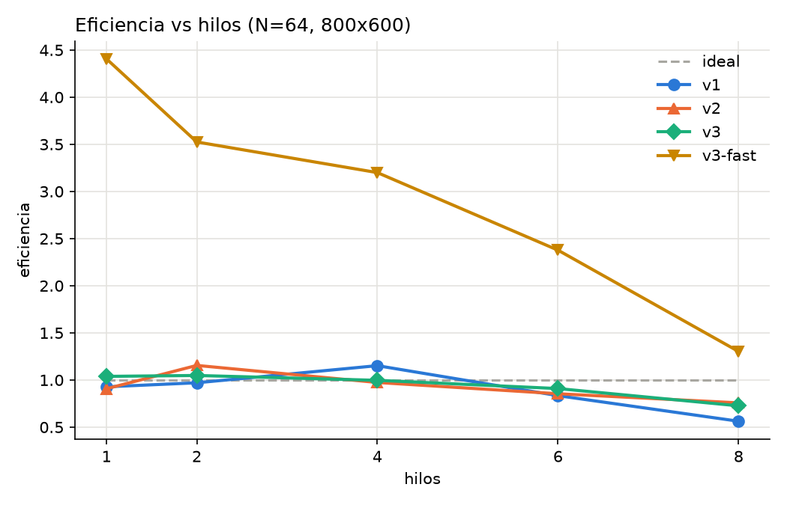

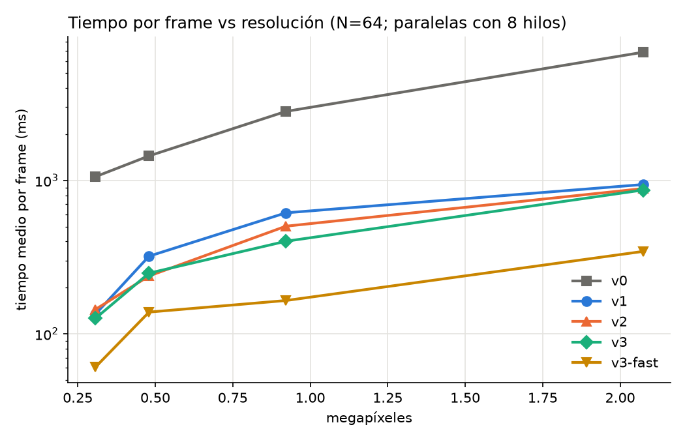

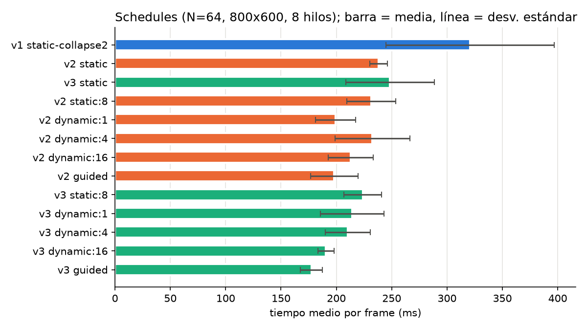

## Capturas de las mediciones

**Barrido A en consola** (cada línea es una prueba; debajo, sus 10 mediciones):

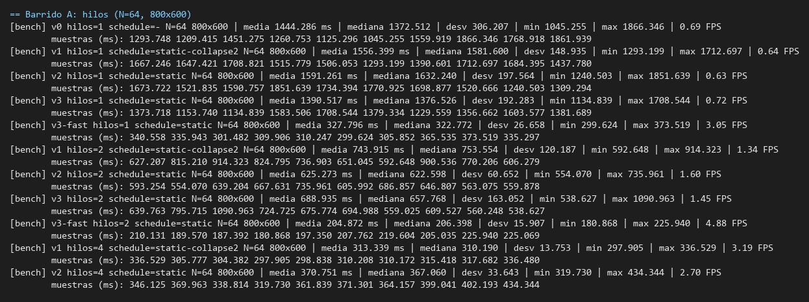

**Búsqueda del N máximo a 60 FPS** (640x480):

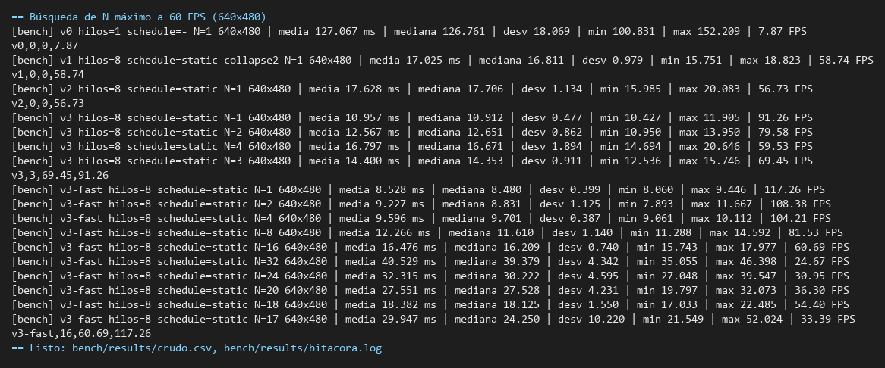

**Ejecución interactiva** (bajo `xvfb-run`; el FPS incluye la presentación):

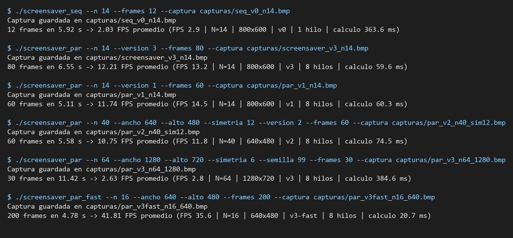

**Programación defensiva:** respuesta del programa ante argumentos inválidos (todos terminan con código 1, sin fallar):

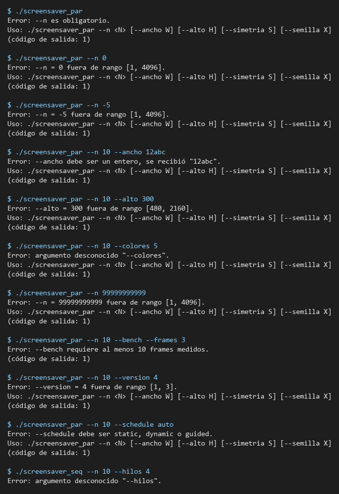

## Capturas del screensaver

| | |
|---|---|
| 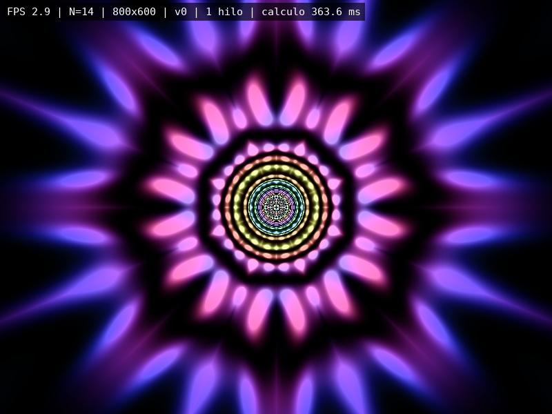 |  |
| v0 secuencial, N=14, 800x600 | v3, 8 hilos, N=14, 800x600 |
| 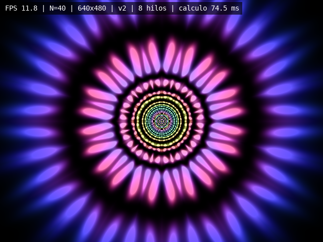 | 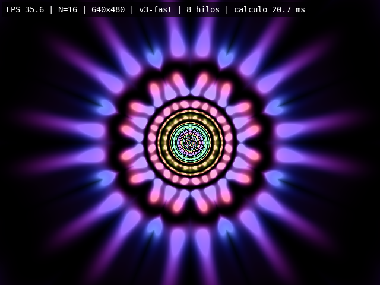 |
| v2, N=40, 640x480, simetría 12 | v3-fast, N=16, 640x480 |

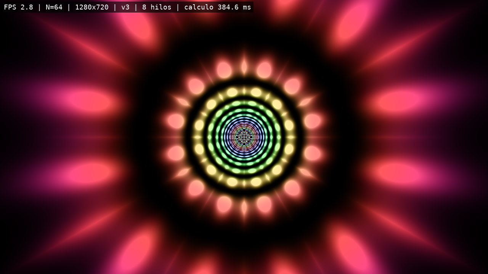

v3, N=64, 1280x720, simetría 6, semilla 99.

## Mediciones individuales

Las 10 mediciones (ms) de cada una de las 66 pruebas, en el orden en que se ejecutaron.

| # | versión | hilos | N | resolución | schedule | m1 | m2 | m3 | m4 | m5 | m6 | m7 | m8 | m9 | m10 |
|---|---|---|---|---|---|---|---|---|---|---|---|---|---|---|---|
| 1 | v0 | 1 | 64 | 800x600 | - | 1293.7 | 1209.4 | 1451.3 | 1260.8 | 1125.3 | 1045.3 | 1559.9 | 1866.3 | 1768.9 | 1861.9 |
| 2 | v1 | 1 | 64 | 800x600 | static-collapse2 | 1667.2 | 1647.4 | 1708.8 | 1515.8 | 1506.1 | 1293.2 | 1390.6 | 1712.7 | 1684.4 | 1437.8 |
| 3 | v2 | 1 | 64 | 800x600 | static | 1673.7 | 1521.8 | 1590.8 | 1851.6 | 1734.4 | 1770.9 | 1698.9 | 1520.7 | 1240.5 | 1309.3 |
| 4 | v3 | 1 | 64 | 800x600 | static | 1373.7 | 1153.7 | 1134.8 | 1583.5 | 1708.5 | 1379.3 | 1229.6 | 1356.7 | 1603.6 | 1381.7 |
| 5 | v3-fast | 1 | 64 | 800x600 | static | 340.6 | 335.9 | 301.5 | 309.9 | 310.2 | 299.6 | 305.9 | 365.5 | 373.5 | 335.3 |
| 6 | v1 | 2 | 64 | 800x600 | static-collapse2 | 627.2 | 815.2 | 914.3 | 824.8 | 736.9 | 651.0 | 592.6 | 900.5 | 770.2 | 606.3 |
| 7 | v2 | 2 | 64 | 800x600 | static | 593.3 | 554.1 | 639.2 | 667.6 | 736.0 | 606.0 | 686.9 | 646.8 | 563.1 | 559.9 |
| 8 | v3 | 2 | 64 | 800x600 | static | 639.8 | 795.7 | 1091.0 | 724.7 | 675.8 | 695.0 | 559.0 | 609.5 | 560.2 | 538.6 |
| 9 | v3-fast | 2 | 64 | 800x600 | static | 210.1 | 189.6 | 187.4 | 180.9 | 197.4 | 207.8 | 219.6 | 205.0 | 225.9 | 225.1 |
| 10 | v1 | 4 | 64 | 800x600 | static-collapse2 | 336.5 | 305.8 | 304.4 | 297.9 | 298.8 | 310.2 | 310.2 | 315.4 | 317.7 | 336.5 |
| 11 | v2 | 4 | 64 | 800x600 | static | 346.1 | 370.0 | 338.8 | 319.7 | 361.8 | 371.3 | 364.2 | 399.0 | 402.2 | 434.3 |
| 12 | v3 | 4 | 64 | 800x600 | static | 366.1 | 355.3 | 368.1 | 370.3 | 370.0 | 349.7 | 369.2 | 337.4 | 363.1 | 373.3 |
| 13 | v3-fast | 4 | 64 | 800x600 | static | 118.1 | 108.3 | 113.3 | 112.9 | 106.7 | 109.9 | 112.8 | 113.6 | 115.7 | 117.1 |
| 14 | v1 | 6 | 64 | 800x600 | static-collapse2 | 248.5 | 288.5 | 278.9 | 326.2 | 302.3 | 274.1 | 325.1 | 331.0 | 250.8 | 260.7 |
| 15 | v2 | 6 | 64 | 800x600 | static | 285.8 | 261.9 | 269.0 | 261.7 | 283.1 | 259.4 | 270.4 | 375.0 | 284.2 | 266.7 |
| 16 | v3 | 6 | 64 | 800x600 | static | 254.6 | 254.8 | 309.7 | 260.9 | 267.6 | 236.3 | 250.8 | 244.6 | 277.9 | 289.9 |
| 17 | v3-fast | 6 | 64 | 800x600 | static | 97.6 | 94.8 | 101.6 | 94.7 | 96.3 | 97.2 | 91.5 | 92.7 | 94.1 | 151.9 |
| 18 | v1 | 8 | 64 | 800x600 | static-collapse2 | 271.2 | 285.8 | 416.8 | 459.1 | 402.7 | 289.6 | 283.4 | 297.0 | 235.8 | 265.6 |
| 19 | v2 | 8 | 64 | 800x600 | static | 243.0 | 241.8 | 242.1 | 228.2 | 232.8 | 230.6 | 236.7 | 235.0 | 236.7 | 255.7 |
| 20 | v3 | 8 | 64 | 800x600 | static | 314.0 | 214.5 | 202.0 | 202.2 | 215.7 | 295.0 | 273.4 | 254.2 | 242.2 | 272.3 |
| 21 | v3-fast | 8 | 64 | 800x600 | static | 218.7 | 223.6 | 173.9 | 127.0 | 111.7 | 107.5 | 98.1 | 101.4 | 103.5 | 120.3 |
| 22 | v0 | 1 | 4 | 800x600 | - | 206.2 | 214.2 | 228.1 | 223.8 | 247.9 | 267.9 | 256.2 | 257.9 | 255.5 | 261.9 |
| 23 | v1 | 8 | 4 | 800x600 | static-collapse2 | 51.5 | 53.7 | 46.4 | 70.2 | 54.3 | 52.9 | 51.2 | 52.0 | 50.3 | 49.7 |
| 24 | v2 | 8 | 4 | 800x600 | static | 46.6 | 42.5 | 46.3 | 44.0 | 46.6 | 48.7 | 46.4 | 42.7 | 42.5 | 45.2 |
| 25 | v3 | 8 | 4 | 800x600 | static | 37.3 | 41.5 | 37.9 | 41.0 | 32.0 | 37.8 | 31.2 | 34.5 | 32.5 | 33.4 |
| 26 | v3-fast | 8 | 4 | 800x600 | static | 23.2 | 23.7 | 21.4 | 25.6 | 25.0 | 31.4 | 35.7 | 27.4 | 23.9 | 22.8 |
| 27 | v0 | 1 | 16 | 800x600 | - | 752.4 | 592.1 | 537.9 | 538.6 | 411.2 | 645.3 | 487.8 | 372.5 | 612.4 | 413.6 |
| 28 | v1 | 8 | 16 | 800x600 | static-collapse2 | 102.8 | 111.7 | 107.1 | 100.1 | 95.4 | 104.0 | 102.2 | 90.2 | 92.7 | 114.4 |
| 29 | v2 | 8 | 16 | 800x600 | static | 110.6 | 121.9 | 111.3 | 112.6 | 77.2 | 73.5 | 91.2 | 112.3 | 85.6 | 79.4 |
| 30 | v3 | 8 | 16 | 800x600 | static | 66.0 | 62.1 | 68.4 | 62.2 | 61.7 | 62.8 | 84.3 | 63.3 | 59.1 | 62.1 |
| 31 | v3-fast | 8 | 16 | 800x600 | static | 26.7 | 28.7 | 27.9 | 27.7 | 29.5 | 29.5 | 36.3 | 32.6 | 33.0 | 31.5 |
| 32 | v0 | 1 | 256 | 800x600 | - | 5484.5 | 5711.5 | 6015.9 | 7242.8 | 7203.8 | 7251.7 | 6723.3 | 7185.6 | 7346.1 | 6814.5 |
| 33 | v1 | 8 | 256 | 800x600 | static-collapse2 | 857.2 | 962.5 | 989.2 | 1541.4 | 1328.0 | 987.1 | 967.4 | 1206.0 | 947.9 | 960.4 |
| 34 | v2 | 8 | 256 | 800x600 | static | 969.5 | 1064.0 | 986.5 | 985.1 | 966.2 | 1005.3 | 935.7 | 1045.2 | 1040.0 | 951.1 |
| 35 | v3 | 8 | 256 | 800x600 | static | 1038.9 | 1018.6 | 1079.1 | 1048.4 | 1139.2 | 945.0 | 1167.2 | 896.8 | 950.0 | 1024.0 |
| 36 | v3-fast | 8 | 256 | 800x600 | static | 691.4 | 362.9 | 490.9 | 374.3 | 358.7 | 322.0 | 342.3 | 405.4 | 386.0 | 330.3 |
| 37 | v0 | 1 | 1024 | 800x600 | - | 27406.5 | 28783.7 | 28345.0 | 28315.7 | 28620.4 | 29132.4 | 28930.9 | 30203.7 | 30533.8 | 29521.8 |
| 38 | v1 | 8 | 1024 | 800x600 | static-collapse2 | 2601.5 | 2670.5 | 2953.3 | 3387.9 | 2872.3 | 2894.3 | 2905.2 | 2752.5 | 2782.6 | 2798.7 |
| 39 | v2 | 8 | 1024 | 800x600 | static | 2929.8 | 2975.7 | 3159.1 | 3693.0 | 3475.8 | 3986.3 | 3173.3 | 3752.6 | 3249.5 | 3354.7 |
| 40 | v3 | 8 | 1024 | 800x600 | static | 2986.7 | 2918.1 | 3156.0 | 3690.0 | 4201.7 | 4033.9 | 4478.2 | 3054.9 | 3271.2 | 3623.4 |
| 41 | v3-fast | 8 | 1024 | 800x600 | static | 1018.9 | 1389.9 | 1162.5 | 1239.9 | 1163.5 | 1316.6 | 1360.8 | 1638.1 | 1678.9 | 1569.0 |
| 42 | v0 | 1 | 64 | 640x480 | - | 781.1 | 1062.5 | 1164.5 | 1069.5 | 1290.2 | 1248.0 | 1120.6 | 1056.3 | 831.7 | 947.8 |
| 43 | v1 | 8 | 64 | 640x480 | static-collapse2 | 122.9 | 131.7 | 139.3 | 125.7 | 148.7 | 155.6 | 131.9 | 119.2 | 126.2 | 143.5 |
| 44 | v2 | 8 | 64 | 640x480 | static | 173.1 | 138.6 | 132.7 | 157.0 | 137.4 | 147.2 | 148.9 | 134.0 | 134.8 | 139.0 |
| 45 | v3 | 8 | 64 | 640x480 | static | 141.5 | 122.5 | 130.8 | 122.2 | 114.9 | 123.0 | 128.9 | 132.6 | 121.2 | 124.1 |
| 46 | v3-fast | 8 | 64 | 640x480 | static | 50.3 | 87.0 | 87.0 | 61.1 | 56.6 | 64.0 | 52.2 | 46.3 | 49.3 | 53.5 |
| 47 | v0 | 1 | 64 | 1280x720 | - | 3143.8 | 2622.7 | 3064.2 | 2541.5 | 2998.3 | 3313.8 | 2693.4 | 2513.9 | 2739.3 | 2522.6 |
| 48 | v1 | 8 | 64 | 1280x720 | static-collapse2 | 549.8 | 563.0 | 605.8 | 655.1 | 515.7 | 593.4 | 607.2 | 578.7 | 729.4 | 747.2 |
| 49 | v2 | 8 | 64 | 1280x720 | static | 562.1 | 553.8 | 471.4 | 610.9 | 502.6 | 510.3 | 415.8 | 481.3 | 412.4 | 507.9 |
| 50 | v3 | 8 | 64 | 1280x720 | static | 393.5 | 431.4 | 399.9 | 439.3 | 374.2 | 384.0 | 463.6 | 368.3 | 396.8 | 360.5 |
| 51 | v3-fast | 8 | 64 | 1280x720 | static | 167.8 | 156.1 | 163.7 | 169.4 | 173.3 | 173.9 | 172.8 | 151.6 | 156.8 | 162.8 |
| 52 | v0 | 1 | 64 | 1920x1080 | - | 5474.4 | 7007.1 | 6231.9 | 6715.5 | 7184.1 | 6804.9 | 6779.5 | 7173.5 | 7615.3 | 7430.7 |
| 53 | v1 | 8 | 64 | 1920x1080 | static-collapse2 | 864.4 | 1196.7 | 932.5 | 976.5 | 849.0 | 891.9 | 983.5 | 824.5 | 924.4 | 953.1 |
| 54 | v2 | 8 | 64 | 1920x1080 | static | 916.3 | 824.9 | 889.6 | 865.4 | 817.3 | 874.1 | 831.9 | 798.1 | 1123.0 | 901.7 |
| 55 | v3 | 8 | 64 | 1920x1080 | static | 812.6 | 821.2 | 791.3 | 885.7 | 845.3 | 848.2 | 853.5 | 945.5 | 888.9 | 959.9 |
| 56 | v3-fast | 8 | 64 | 1920x1080 | static | 310.2 | 346.9 | 308.2 | 321.2 | 358.2 | 310.1 | 388.2 | 351.6 | 333.4 | 415.3 |
| 57 | v2 | 8 | 64 | 800x600 | static:8 | 207.6 | 222.3 | 219.5 | 202.3 | 224.7 | 252.9 | 257.7 | 246.4 | 215.8 | 264.6 |
| 58 | v2 | 8 | 64 | 800x600 | dynamic:1 | 182.9 | 187.9 | 194.6 | 192.2 | 197.6 | 181.8 | 185.5 | 217.0 | 219.7 | 234.5 |
| 59 | v2 | 8 | 64 | 800x600 | dynamic:4 | 232.1 | 233.7 | 229.6 | 262.6 | 307.4 | 214.8 | 189.2 | 217.5 | 242.7 | 196.2 |
| 60 | v2 | 8 | 64 | 800x600 | dynamic:16 | 235.7 | 245.9 | 232.0 | 195.4 | 196.2 | 219.1 | 211.9 | 192.2 | 186.9 | 216.6 |
| 61 | v2 | 8 | 64 | 800x600 | guided | 179.2 | 181.6 | 192.5 | 240.0 | 202.0 | 177.8 | 188.2 | 224.9 | 213.8 | 181.6 |
| 62 | v3 | 8 | 64 | 800x600 | static:8 | 225.6 | 218.6 | 228.2 | 235.5 | 232.8 | 202.5 | 249.0 | 198.3 | 206.6 | 242.1 |
| 63 | v3 | 8 | 64 | 800x600 | dynamic:1 | 260.9 | 243.0 | 235.0 | 200.5 | 221.0 | 205.5 | 228.1 | 174.0 | 172.1 | 204.1 |
| 64 | v3 | 8 | 64 | 800x600 | dynamic:4 | 190.4 | 183.8 | 189.7 | 229.5 | 242.2 | 235.0 | 197.5 | 214.5 | 205.8 | 214.4 |
| 65 | v3 | 8 | 64 | 800x600 | dynamic:16 | 184.3 | 195.7 | 187.7 | 193.3 | 192.2 | 201.1 | 198.8 | 184.3 | 191.2 | 177.2 |
| 66 | v3 | 8 | 64 | 800x600 | guided | 170.1 | 170.1 | 171.8 | 173.7 | 176.6 | 173.2 | 195.6 | 196.8 | 175.3 | 172.0 |
